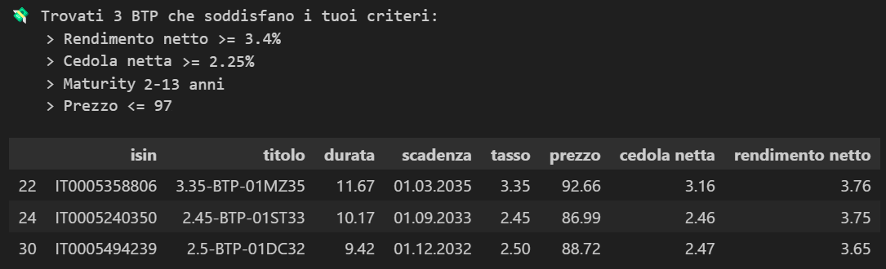

# **💸 Best BTP Finder**

Questo notebook permette effettua lo scraping dal sito web [www.rendimentibtp.it](https://www.rendimentibtp.it/) relativo ai BTP (obbligazioni governative dello stato Italiano) e di filtrare/esplorare i dati secondo i propri criteri.

Eseguire tutto il notebook e poi interagire con i dati tramite l'ultima cella.

---

**Modificare i parametri:**
- `MIN_CEDOLA_NETTA` = 2.25 (valore percentuale 2.0 --> 2.0%)
- `MIN_DURATA_ANNI` = 2 (in anni)
- `MAX_DURATA_ANNI` = 13 (in anni)
- `MIN_RENDIMENTO_NETTO` = 3.40 (valore percentuale 2.0 --> 2.0%)
- `MAX_PREZZO` = 97 (valore in €)

---

**Esempio:**

